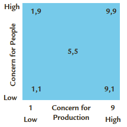
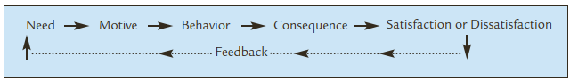
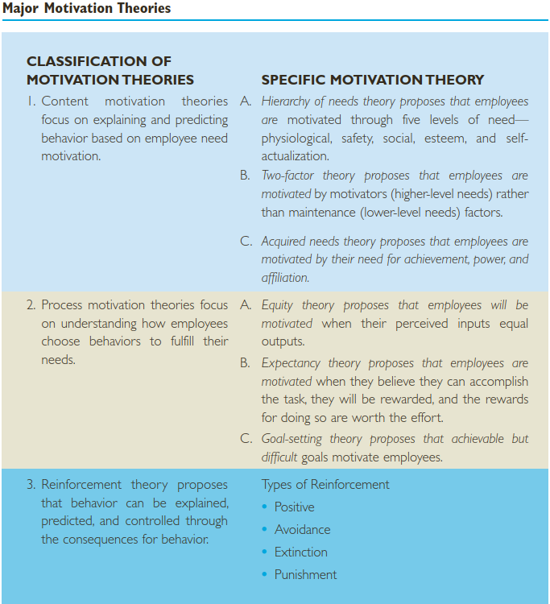
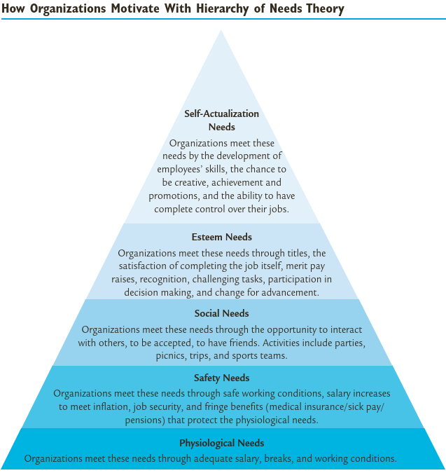
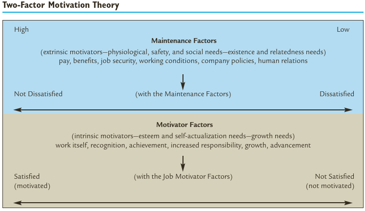
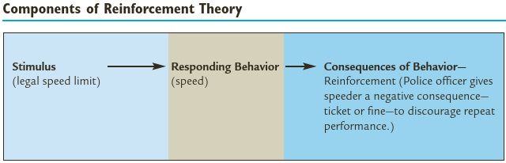

```{r setup, include=FALSE}
knitr::opts_chunk$set(echo = FALSE)
```


### Capaian Pembelajaran

- Hasil penelitian menunjukkan bahwa perilaku pemimpin mempengaruhi prestasi pengikutnya. 
- Pemimpin dapat menggunakan (teladan) perilaku untuk meningkatkan, mengembangkan dan mempertahankan prestasi anak buahnya.  
- Tugas mendasar seorang pemimpin adalah memotivasi anak buahnya.

Setelah mempelajari bab ini dengan baik, Anda `seharusnya` mampu: 

1. Menjelaskan gaya kepemimpinan menurut Universitas Iowa. 
2. Menjelaskan perbedaan dan persamaan antara model kepemimpin Universitas Michigan dengan Universitas Iowa.  
3. Menjelaskan perbedaan dan persamaan antara model kepemimpinan Universitas Ohio dengan the Leadership Grid.
4. Menerangkan perbedaan dan persamaan antara tiga teori motivasi kepuasan (*three content motivation theories*). 
5. Menerangkan persamaan dan perbedaan antara tiga proses teori motivasi. 
6. Menjelaskan empat jenis penguatan kembali (*reinforcement*). 
7. Menjelaskan perbedaan antara teori *content, process*, dan *reinforcement*.

---

### Perilaku dan Gaya Kepemimpinan

- Paradigma teori perilaku berpusat pada apa yang dikatakan dan dilakukan oleh pemimpin. 
- Paradigma ini mencari perbedaan perilaku antara pemimpin yang efektif dengan yang tidak efektif.
- Walaupun ahli-ahli teori perilaku fokus pada perilaku, perilaku pemimpin didasarkan pada traits and skills. Sifat bawaan dan kepribadian pemimpin mempengaruhi perilaku dan hubungannya dengan pengikutnya.
- Memberikan teladan sangat penting bagi manajer, karena pengikut akan mengamati dan mencontohnya. 
- Perilaku lebih mudah diubah dibandingkan sifat bawaan. 

---

### Gaya Kepemimpinan Universitas Iowa

- Gaya kepemimpinan otokratik (*Autocratic leadership style*). Pemimpin otokratik membuat keputusan, mendikte dan mengawasi bawahannya dengan ketat.
- Gaya kepemimpinan demokratik (*democratic leadership style*). Pemimpin demokratik mendorong partisipasi dalam pengambilan keputusan, bekerja sama dengan pengikut dan tidak mendikte bawahannya. 

### Model Kepemimpinan Universitas Michigan

- Gaya kepemimpinan berpusat pada pekerjaan/tugas (*Job-Centered Leadership Style*).
  - Mementingkan selesainya pekerjaan
  - Mengarahkan bawahan secar detil apa dan bagaimana menyelesaikan pekerjaan. 
- Gaya kepemimpinan berpusat pada pekerja (*Employee-Centered Leadership Style*).
  - Mementingkan kebutuhan dan kesejahteraan bawahan. 
  - Peka terhadap bawahan dan berkomunikasi untuk membangun kepercayaan, dukungan dan rasa hormat bawahan. 
  
---

### Model Kepemimpinan Universitas Ohio

- Initiating structure behavior: secara esensi sama dengan (*job-centered leadership style*); it focuses on getting the task done.
- Consideration behavior: secara esensi sama dengan (*employee-centered leadership style*); it focuses on meeting people’s needs and developing relationships.
- Dibagi menjadi empat gaya kepemimpinan: low structure and high consideration, high structure and high consideration, low structure and low consideration, and high structure and low consideration. 
- Leaders with high structure and low consideration behaviour use one-way communications, and decisions are made by the managers, whereas leaders with high consideration and low structure use two-way communications and tend to share decision making.

---

### Teori Kepemimpian Grid

- The impoverished leader (1,1) has low concern for both production and people. The
leader does the minimum required to remain employed in the position.
- The authority-compliance leader (9,1) has a high concern for production and a low concern for people. The leader focuses on getting the job done while people are treated like machines.
- The country-club leader (1,9) has a high concern for people and a low concern for
production. The leader strives to maintain a friendly atmosphere without regard for
production.
- The middle-of-the-road leader (5,5) has balanced, medium concern for both production
and people. The leader strives to maintain satisfactory performance and morale.
- The team leader (9,9) has a high concern for both production and people. This leader
strives for maximum performance and employee satisfaction. Model ini umumnya paling tepat digunakan pada berbagai situasi. 

```{r out.width="30%", echo=FALSE}

```
`Sumber: Lussier, Robert N. dan Christopher F. Achua (2016)`

---

### Motivasi dan Kepemimpinan

*Proses Motivasi*

```{r out.width="90%", echo=FALSE}

```
`Sumber: Lussier, Robert N. dan Christopher F. Achua (2016)`

### Tiga Teori Motivasi Utama

- Tidak ada satu teori motivasi yang diterima secara universal.
- Kita akan mempelajari tiga teori motivasi: **content motivation theories, process motivation theories, dan reinforcement theory**.

```{r out.width="70%", echo=FALSE}

```
`Sumber: Lussier, Robert N. dan Christopher F. Achua (2016)`

**Content Motivation Theories**

- Focus on explaining and predicting behaviour based on people’s needs. 
- The primary reason people do what they do is to meet their needs or wants—to be satisfied. 
- Jadi penting untuk memahami teori butuhan (*content motivation theory*). 
- Orang menginginkan kepuasan kerja, dan mereka mau pindah ketempat lain untuk mendapatkan kepuasan kerja. 
- Kunci keberhasilan kepemimpinan adalah memenuhi kebutuhan bawahan sekaligus mencapai tujuan perusahaan. 

*Hirarki Kebutuhan (hierarchy of needs)*

The hierarchy of needs theory proposes that people are motivated through five levels of needs—physiological, safety, belongingness, esteem, and self-actualization:

1. Physiological needs: These are people’s primary or basic needs: air, food, shelter, sex, and relief from or avoidance of pain.
2. Safety needs: Once the physiological needs are met, the individual is concerned
with safety and security.
3. Belongingness needs: After establishing safety, people look for love, friendship, acceptance, and affection. Belongingness is also called social needs.
4. Esteem needs: After the social needs are met, the individual focuses on ego, status, self-respect, recognition for accomplishments, and a feeling of self-confidence and prestige.
5. Self-actualization needs: The highest level of need is to develop one’s full potential. To do so, one seeks growth, achievement, and advancement.

### Memotivasi Bawahan dengan Teori Hirarki Kebutuhan

> Anda harus mengetahui dan memahami kebutuhan bawahan dan memenuhinya sebagai salah satu cara untuk meningkatkan kinerja mereka. 

- An important contribution of this theory is that we realize that people have a need for more than just pay. 
- Second, even if we don’t have much money to give raises, we can have inexpensive socials, like barbecues, and there is no cost to giving compliments.
- Also, employees are more motivated when they perceive the organization supports them, which again does not have to be costly.
- People want to fulfil higher-level needs, including self-esteem and recognition from peers,so a major recommendation to leaders is to meet employees’ lower-level needs so that they will not dominate the employees’ motivational process. 

```{r out.width="70%", echo=FALSE}

```
`Sumber: Lussier, Robert N. dan Christopher F. Achua (2016)`


**Teori Motivasi Dua Faktor Herzberg**


```{r out.width="70%", echo=FALSE}

```
`Sumber: Lussier, Robert N. dan Christopher F. Achua (2016)`

**Acquired Needs theory**

- Orang punya kebutuhan pencapaian, kekuasaan dan afiliasi.

- Motivating employees with a high n Ach: 
  - Give them nonroutine, challenging tasks with clear, attainable objectives. Give them fast and frequent feedback on their performance.
  - Continually give them increased responsibility for doing new things. Keep out of their way.
  
- Motivating employees with a high n Pow:
  - Let them plan and control their jobs as much as possible. 
  - Try to include them in decision making, especially when they are affected by the decision. They tend to perform best alone rather than as team members. 
  - Try to  assign them to a whole task rather than just part of a task.
  
- Motivating employees with a high n Aff:
  - Be sure to let them work as part of a team. They derive satisfaction from the people they work with rather than the task itself. 
  - Give them lots of praise and recognition. Delegate responsibility for orienting and training new employees to them. They make great buddies and mentors.

---


### Teori Proses Motivasi (*Process Motivation Theories*)

- Process motivation theories focus on understanding how people choose behaviour to 
fulfil their needs. 
- Process motivation theories are more complex than content motivation theories.
- Content motivation theories simply focus on identifying and understanding 
people’s needs. 
- Process motivation theories go a step further by attempting to understand 
the following: why people have different needs, why their needs change, how and why 
people choose to try to satisfy needs in different ways, the mental processes people go through as they understand situations, and how they evaluate their need satisfaction.

**Teori Ekuitas (Equity Theory)**

- People are motivated when their perceived inputs equal outputs.

**Teori Harapan (Expectancy theory)**

- People are motivated when they believe they can accomplish the task, they will get the reward, and the rewards for doing the task are worth the effort. 

**Teori Penetapan Tujuan (Goal-Setting theory)**

- Specific, difficult goals motivate people. 
- Goal setting increases commitment, motivation, energy, and persistence toward goals

---


### Teori Penguatan Kembali (*Reinforcement Theory*)

- Through the consequences for behaviour, people will be motivated to behave in predetermined ways.


```{r out.width="70%", echo=FALSE}

```
`Sumber: Lussier, Robert N. dan Christopher F. Achua (2016)`

**Jenis-jenis Penguatan Kembali**

- *Positive Reinforcement*: A method of encouraging continued behaviour is to offer attractive consequences (rewards) for desirable performance. Positive reinforcements are pay, promotions, time off, increased status, and so forth. Giving praise is a positive reinforcement.

- *Avoidance Reinforcement*: Avoidance is also called negative reinforcement. Rules with punishment for violations are designed to get employees to avoid certain behaviour. Employees don’t necessarily want to follow the rules, but they usually do to avoid the negative consequence of punishment.

- *Punishment*: used to provide an undesirable consequence for undesirable behavior. 
Methods of punishment include harassing, taking away privileges, probation, fining, demoting, firing, and so forth.

- *Extinction*: rather than encourage desirable behaviour, extinction (and punishment) attempts to reduce or eliminate undesirable. Extinction also includes ignoring the behaviour to get the employee to stop it.


